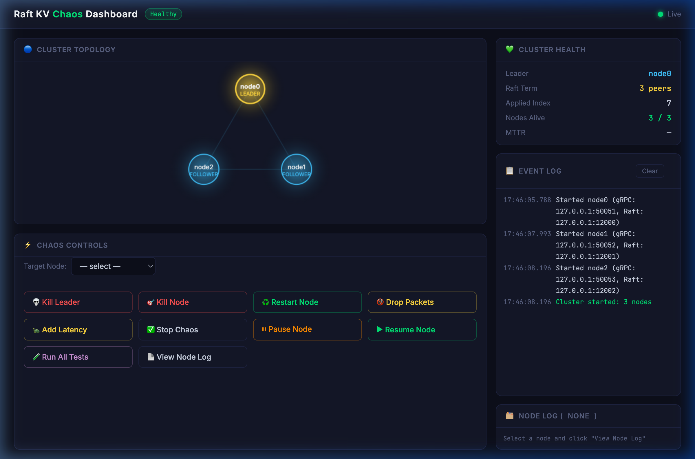

<div align="center">
  <h1>Raft KV Store & Chaos Dashboard</h1>
  <p><i>A fault-tolerant, distributed key-value store built on HashiCorp Raft, armed with a web-based Chaos Testing Dashboard for live failure injection and real-time cluster observation.</i></p>

  <!-- Badges -->
  <a href="https://golang.org"></a>
  <a href="https://github.com/hashicorp/raft"></a>
  

  <br><br>

  

</div>

---

## Documentation

| # | Document | Contents |
|---|---|---|
| 1 | **[Quickstart](docs/1_QUICKSTART.md)** | Clone, build, and run the cluster |
| 2 | **[Architecture](docs/2_ARCHITECTURE.md)** | System design, write/read paths, two-port layout |
| 3 | **[Guarantees](docs/3_GUARANTEES.md)** | Consistency, MTTR, quorum safety, partition safety, durability |
| 4 | **[Tests & Results](docs/4_TESTS.md)** | All 4 test phases with results tables |
| 5 | **[Code Overview](docs/5_CODE.md)** | Per-file deep dives (node, FSM, dashboard, chaos proxy, frontend) |
| 6 | **[Intern Guide](docs/intern/ICEBREAKER.md)** | Step-by-step onboarding for new contributors |

---

##  Quick Start

> **Prerequisites:** Go `1.21+` installed on your system.

```bash
# 1. Build the dashboard (macOS-safe build command)
GOCACHE=/tmp/go-cache GOTMPDIR=/tmp/gobuild go build -o kv-dashboard ./cmd/dashboard/

# 2. Run a 3-node cluster
./kv-dashboard -nodes=3 -port=8080

# 3. Open the UI
open http://localhost:8080
```

---

##  What It Does

-  **Distributed KV Store** — `Get`, `Set`, `Delete` operations with strong consistency via Raft consensus.
-  **Fault Tolerance** — Safely tolerates `⌊N/2⌋` simultaneous node failures without data loss or split-brain.
-  **Chaos Dashboard** — Interactive UI to kill nodes, inject network partitions (SIGSTOP), add latency, or drop packets.
-  **Live Topology** — HTML5 Canvas visualization of cluster state (`Leader` / `Follower` / `Dead`).
-  **Automated Test Scripts** — `verify.sh` & `verify_phase2.sh` for proving distributed systems guarantees empirically.

---

## 🏆 Proven Guarantees

| Guarantee | Measured Result |
|---|---|
| **Leader MTTR** after crash | **~1 second** (Verified on 3-node and 11-node clusters) |
| **Quorum Boundary** | **Exact `⌊N/2⌋+1`** (Safely halts writes on quorum loss) |
| **No Split-Brain** |  Proven via SIGSTOP network partition tests |
| **Write Durability** |  BoltDB persistence; survives total cluster wipe |
| **Log Catch-up** |  Full replication sync after a partition heals |

---

##  Failure Model Coverage

| Failure Type | Injection Mechanism | Status |
|---|---|---|
| **Crash / Fail-stop** | `SIGKILL` → `/api/kill` |  Implemented |
| **Network Partition** | `SIGSTOP` → `/api/pause` |  Implemented |
| **Receive Omission** | `kv-chaos` drops initial TCP connection |  Implemented |
| **Send Omission / Latency** | `kv-chaos` proxy jitter/delay |  Implemented |
| **Slow Node (Resource)** | Pending Phase 3 script |  Next |
| **Durability (Total Wipe)** | Pending Phase 4 script |  Next |

---

## 🛠️ Project Structure

```text
store/
├── main.go              #  kv-store node entrypoint
├── server/
│   ├── node.go          #  Raft setup + gRPC handlers
│   └── fsm.go           #  Key-value FSM + snapshots
├── proto/               #  Protobuf service definitions
├── cmd/
│   ├── client/          #  kv-client CLI tool
│   ├── chaos/           #  kv-chaos TCP fault proxy
│   └── dashboard/       #  Dashboard HTTP server + frontend
├── docs/                #  All documentation & Sub-READMEs
├── verify.sh            #  Phase 1 tests script
├── verify_phase2.sh     #  Phase 2 tests (SIGSTOP partitions)
└── run_chaos_test.sh    #  Integration test suite
```
