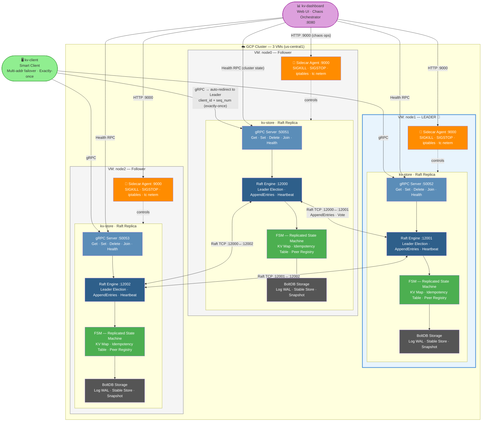
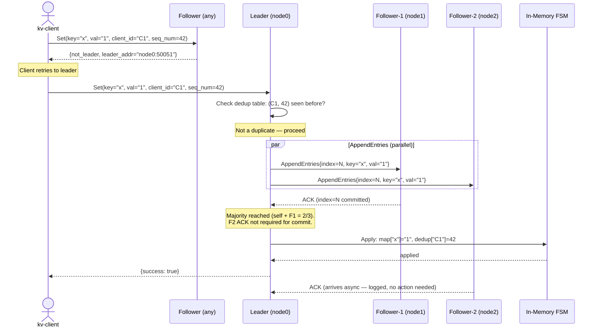

# Diagram Specifications — Distributed Raft KV Store v1.2
**Purpose:** LLM-ready diagram generation prompts. Each diagram is provided as:
1. Mermaid code (render at mermaid.live, GitHub, Notion, or any Mermaid-compatible tool)
2. Visual description prompt (for Excalidraw, Lucidchart, Google Slides manual creation, or AI image tools)
3. Placement guidance (which slide/report section + recommended size/caption)

---

## Existing Graphs (Do NOT regenerate — already in `analysis/graphs/`)

| File | Content | Use |
|------|---------|-----|
| `latency_quorum_proof.png` | Bar chart: baseline vs slow-follower vs slow-leader write latency | Slide 4 + Report results |
| `availability_mttr.png` | Timeline: detection window + election window → MTTR | Slide 4 + Report results |
| `durability_proof.png` | Bar chart: D1/D2/D3 key recovery ratio | Report results section |

> **Note:** `old_docs/dashboard.png` is a UI screenshot — do NOT include in the report (course rules prohibit screenshots of dashboards).

---

## D1 — System Architecture Diagram (3-Node, Layered)
**Used in:** Slide 2 (primary visual) + Report system design section
**Placement:** Full-width, center of Slide 2. In report: half-page width, left-aligned, caption below.
**Caption:** *"Fig. 1: Three-replica consensus group on GCP. Each VM runs a kv-store Raft Replica (gRPC → Raft Engine → FSM → BoltDB) and an independent Sidecar Agent for chaos injection. The Leader role is elected by Raft and can move to any replica."*

### Component Inventory

| Layer | Component | Port | Source |
|-------|-----------|------|--------|
| gRPC Server | Get · Set · Delete · Join · Health | `:50051+i` | `server/node.go` |
| Raft Engine | Leader Election · AppendEntries · Heartbeat | TCP `:12000+i` | HashiCorp Raft v1.7.3 |
| FSM | KV Map · Idempotency Table · Peer Registry | — | `server/fsm.go` |
| BoltDB | Raft Log (WAL) · Stable Store · Snapshot | — | `go.etcd.io/bbolt` |
| Sidecar Agent | SIGKILL · SIGSTOP · iptables · tc netem | HTTP `:9000` | `cmd/agent/main.go` |
| Dashboard | Web UI · Chaos Orchestrator · Health Poller | HTTP `:8080` | `cmd/dashboard/main.go` |
| Smart Client | Multi-addr failover · Leader redirect · Exactly-once | — | `cmd/client/main.go` |

### Mermaid Code

### Color Key
| Color | Element |
|-------|---------|
| Blue border (VM1) | Current Leader |
| Steel blue `#5B8DB8` | gRPC Server layer |
| Dark blue `#2E5F8A` | Raft Engine layer |
| Green `#4CAF50` | FSM (Replicated State Machine) layer |
| Dark grey `#555555` | BoltDB storage layer |
| Orange `#FF8C00` | Sidecar Agent |
| Light green | kv-client |
| Purple | kv-dashboard |

### Visual Description Prompt (for Excalidraw / AI image tools)

> Draw a distributed systems architecture diagram in a clean, modern style inspired by the etcd architecture diagrams.
>
> **Outer box:** Large rounded rectangle labeled "☁️ GCP Cluster — us-central1". Light blue background tint.
>
> **Three VM boxes** arranged side by side (horizontal layout). Each VM is a white rounded rectangle. The **middle VM** (node1 = Leader) has a blue border and blue header label "LEADER 👑". The left (node0) and right (node2) VMs have grey borders and grey label "Follower".
>
> **Inside each VM**, two stacked sections:
>
> **Section 1 — kv-store (Raft Replica):** A rectangle with 4 horizontal color bands stacked top-to-bottom:
> - Steel blue band: **gRPC Server** — `:50051+i` — "Get · Set · Delete · Health · Join"
> - Dark blue band: **Raft Engine** — `:12000+i` — "Leader Election · AppendEntries · Heartbeat"
> - Green band: **FSM** — "KV Map · Idempotency Table · Peer Registry"
> - Dark grey band: **BoltDB** — "WAL · Stable Store · Snapshot"
>
> **Section 2 — Sidecar Agent:** Below the kv-store rectangle, a separate orange rectangle labeled "🔧 Sidecar Agent :9000" with sub-text "SIGKILL · SIGSTOP · iptables · tc netem". A dotted orange arrow points upward from the Sidecar Agent into the kv-store box, labeled "controls".
>
> **Raft consensus band:** A horizontal dashed light-blue band connecting all three "Raft Engine" rows across VMs (like the connecting band in the etcd diagram). Label: "Raft Consensus — AppendEntries · Heartbeat · RequestVote".
>
> **External — left of GCP box:** Light green rounded rectangle: "🖥️ kv-client — Smart Client". Arrow right into node0 gRPC Server: "gRPC → auto-redirect to Leader". Small badge: "Exactly-once: clientID + seqNum".
>
> **External — above GCP box:** Purple rounded rectangle: "📊 kv-dashboard :8080 — Web UI · Chaos Orchestrator". Thin arrows down to each node's gRPC Server ("Health RPC"). Orange arrows down to each Sidecar Agent ("HTTP chaos ops").
>
> **Bottom caption callout box:** "Write commits after ACK from ⌊N/2⌋+1 = 2 replicas · Minority partition → writes blocked (CP Safety) · MTTR ~1.25s"

---

## D2 — Write Path Sequence Diagram
**Used in:** Report system design section
**Placement:** Half-page width in report, immediately after the architecture diagram. Caption below.
**Caption:** *"Fig. 2: Write path for a Set operation. The leader commits after receiving acknowledgment from any majority. Slow or partitioned followers do not block the commit."*

### Mermaid Code

### Visual Description Prompt

> Draw a sequence diagram for a distributed key-value write operation with these participants left-to-right: "kv-client", "Follower (any replica)", "Leader (node0)", "Follower-1 (node1)", "Follower-2 (node2)", "In-Memory FSM".
>
> Steps:
> 1. kv-client → Follower: solid arrow "Set(key, val, client_id=C1, seq_num=42)"
> 2. Follower → kv-client: dashed arrow "{not_leader, leader_addr}"
> 3. Note box above kv-client: "Client retries to leader"
> 4. kv-client → Leader: solid arrow "Set(key, val, C1, seq_num=42)"
> 5. Leader self-loop: "Check dedup table: (C1, 42) already committed?"
> 6. Leader → Follower-1 AND Leader → Follower-2: parallel solid arrows "AppendEntries{index=N}"
> 7. Follower-1 → Leader: dashed arrow "ACK"
> 8. Note box: "Majority reached (self + Follower-1). Follower-2 not required."
> 9. Leader → FSM: solid arrow "Apply: map[key]=val"
> 10. Leader → kv-client: dashed arrow "{success: true}"
> 11. Follower-2 → Leader: dashed grey arrow "ACK (async, ignored)" — this arrives after commit
>
> Color: Leader column header in gold. The "Majority reached" note box in green. The "not_leader" redirect in red/orange.

---

## D3 — Partition Fix: Before vs After (BUG-4)
**Used in:** Slide 4 technical challenge callout box + Report implementation section
**Placement:** Two-panel side-by-side. Left = broken (red border). Right = fixed (green border).
**Caption:** *"Fig. 3: BUG-4 — One-directional iptables (left) creates receive-omission only: isolated leader still sends heartbeats, stays leader, and accepts writes (CP safety violation). Bidirectional iptables (right) creates a true symmetric partition: followers miss heartbeats, election fires, new leader elected."*

### Mermaid Code

### Visual Description Prompt

> Draw a two-panel "before and after" comparison diagram for a network partition scenario.
>
> **Left panel (red border, label "❌ BEFORE — BUG-4 — Receive Omission Only"):**
> - Three node circles: "Leader 👑" (gold), "Follower-1" (grey), "Follower-2" (grey)
> - Solid green arrows FROM Leader TO Follower-1 and Follower-2, labeled "Heartbeat — OUTBOUND (unblocked)"
> - Red X'd dashed arrows FROM Follower-1 and Follower-2 TO Leader, labeled "ACK — BLOCKED (INPUT DROP)"
> - Red result box: "Followers keep receiving heartbeats → No election fires → Leader stays leader → Writes ACCEPTED = CP SAFETY VIOLATION"
>
> **Right panel (green border, label "✅ AFTER — v1.2 Fix — Symmetric Partition"):**
> - Three node circles: "Leader" (grey — no longer elected leader), "Follower-1" (grey), "Follower-2" (grey)
> - Red X'd dashed arrows FROM Leader TO Follower-1 and Follower-2, labeled "Heartbeat — BLOCKED (OUTPUT DROP per peer port)"
> - Red X'd dashed arrows FROM Follower-1/2 TO Leader, labeled "ACK — BLOCKED (INPUT DROP)"
> - Green result box: "Followers miss heartbeats → Election timeout fires → New leader elected in ~1.25s → Old leader's writes REJECTED = CP Safety preserved"
>
> **Below the two panels:** iptables rules side-by-side:
> - Left: `iptables -A INPUT -p tcp --dport 12000 -j DROP` (only this)
> - Right: `iptables -A INPUT -p tcp --dport 12000 -j DROP` + `iptables -A OUTPUT -p tcp --dport 12001 -j DROP` + `iptables -A OUTPUT -p tcp --dport 12002 -j DROP`

---

## Summary: What to Generate and Where to Use It

| Diagram | Tool | Slide | Report Section |
|---------|------|-------|---------------|
| D1 — Architecture (3-node, layered) | Mermaid → export PNG, or Excalidraw visual description | Slide 2 (full width) | System Design — §1 overview |
| D2 — Write path sequence | Mermaid → export PNG | — | System Design — §4 write path |
| D3 — Partition before/after | Mermaid → export PNG, or manual Slides | Slide 4 (callout box, half-width) | Implementation — §6 partition design |
| latency_quorum_proof.png | Already exists | Slide 4 (embed) | Results |
| availability_mttr.png | Already exists | Slide 4 (embed) | Results |
| durability_proof.png | Already exists | — | Results |

## Rendering Instructions

**Option A — Mermaid Live (fastest):**
1. Go to mermaid.live
2. Paste any Mermaid code block above
3. Export as PNG (high-res, transparent background)
4. Import into Google Slides / report

**Option B — GitHub (if repo is accessible):**
1. Create a `.md` file with the Mermaid code blocks
2. GitHub renders them automatically in the preview
3. Screenshot the rendered diagram (high-DPI display recommended)

**Option C — VS Code:**
1. Install "Markdown Preview Mermaid Support" extension
2. Open any `.md` with Mermaid blocks
3. Use "Export" from the preview pane
