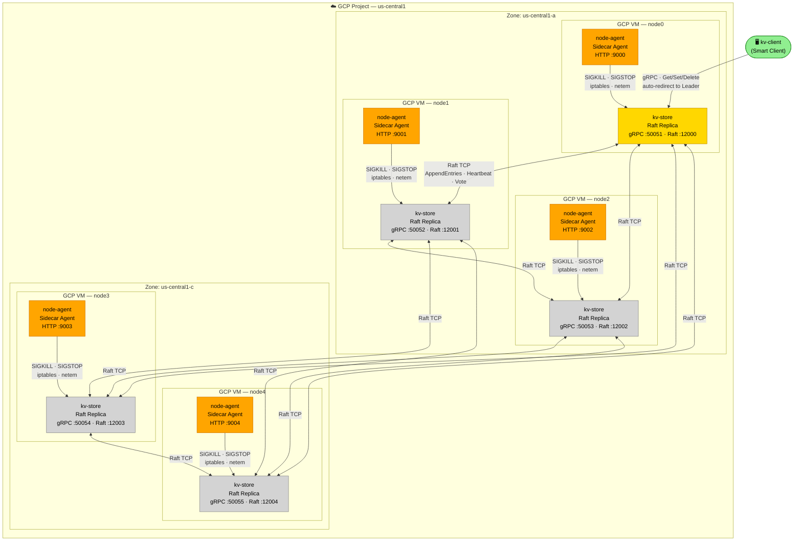
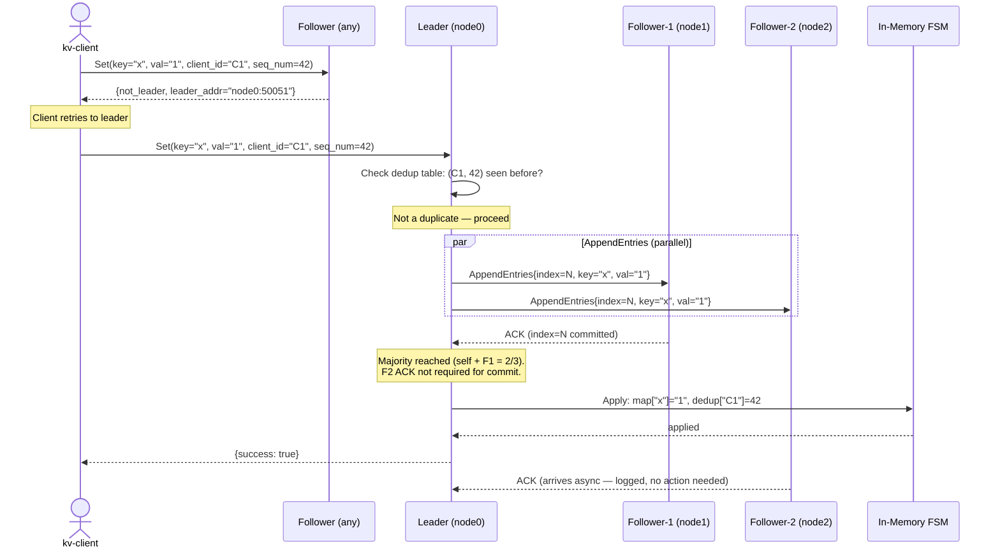
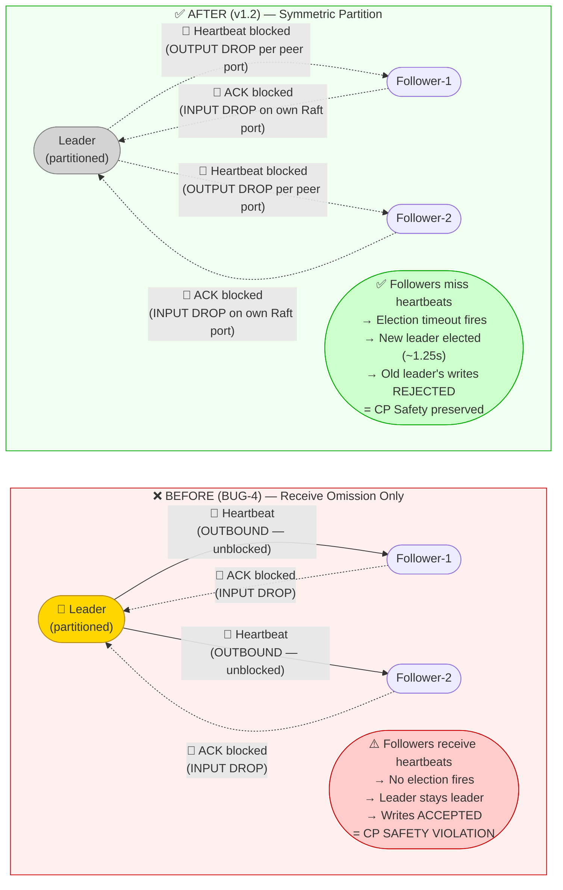

# Diagram Specifications — Distributed Raft KV Store v1.2
**Purpose:** LLM-ready diagram generation prompts. Each diagram is provided as:
1. Mermaid code (render at mermaid.live, GitHub, Notion, or any Mermaid-compatible tool)
2. Visual description prompt (for Excalidraw, Lucidchart, Google Slides manual creation, or AI image tools)
3. Placement guidance (which slide/report section + recommended size/caption)

---

## Existing Graphs (Do NOT regenerate — already in `analysis/graphs/`)

| File | Content | Use |
|------|---------|-----|
| `latency_quorum_proof.png` | Bar chart: baseline vs slow-follower vs slow-leader write latency | Slide 4 + Report results |
| `availability_mttr.png` | Timeline: detection window + election window → MTTR | Slide 4 + Report results |
| `durability_proof.png` | Bar chart: D1/D2/D3 key recovery ratio | Report results section |

> **Note:** `old_docs/dashboard.png` is a UI screenshot — do NOT include in the report (course rules prohibit screenshots of dashboards).

---

## D1 — System Architecture Diagram
**Used in:** Slide 2 (primary visual) + Report system design section
**Placement:** Full-width, center of Slide 2. In report: half-page width, left-aligned, caption below.
**Caption:** *"Fig. 1: Five-replica consensus group on GCP. Each VM runs a Raft Replica (kv-store) and a Sidecar Agent (node-agent). All replicas are peers — the Leader role is elected by Raft and can move to any node."*

### Mermaid Code

> **Note for slide version:** KV0 (gold) = current leader. KV1–KV4 (grey) = followers. Simplify for slide by removing port numbers from the node labels — put ports in a legend box instead.

### Visual Description Prompt (for Excalidraw / Lucidchart / AI image tools)

> Draw a distributed systems architecture diagram with the following elements:
>
> **Layout:** Outer boundary box labeled "☁️ GCP Project — us-central1". Inside, two zone boxes side-by-side: "Zone A (us-central1-a)" containing 3 VMs, "Zone C (us-central1-c)" containing 2 VMs.
>
> **Each VM box** contains two sub-elements stacked vertically:
> - Top (gold/yellow for node0, grey for node1–4): rectangle labeled "kv-store Raft Replica" with two port badges: "gRPC :5005X" and "Raft TCP :1200X"
> - Bottom (orange): smaller rectangle labeled "node-agent Sidecar Agent"
>
> **Arrows:**
> - Red bidirectional arrows connecting all 5 kv-store boxes to each other (full mesh). Label one arrow "Raft: AppendEntries · Heartbeat · Vote"
> - Green arrow from external "kv-client" box (outside the GCP boundary) pointing to node0's kv-store. Label: "gRPC Get/Set/Delete → auto-redirect to Leader"
> - Orange arrow from each node-agent down to its kv-store. Label on one: "SIGKILL · SIGSTOP · iptables · netem"
>
> **Color scheme:**
> - node0 kv-store: gold (#FFD700) = Leader
> - node1–4 kv-store: light grey = Followers
> - All node-agents: orange (#FFA500)
> - kv-client: light green
>
> **Crown emoji** 👑 on node0 to indicate it is the current leader.
>
> **Bottom caption:** "Write commits when leader receives ACK from ⌊N/2⌋+1 replicas. Minority partition → writes blocked (CP Safety)."

---

## D2 — Write Path Sequence Diagram
**Used in:** Report system design section
**Placement:** Half-page width in report, immediately after the architecture diagram. Caption below.
**Caption:** *"Fig. 2: Write path for a Set operation. The leader commits after receiving acknowledgment from any majority. Slow or partitioned followers do not block the commit."*

### Mermaid Code

### Visual Description Prompt

> Draw a sequence diagram for a distributed key-value write operation with these participants left-to-right: "kv-client", "Follower (any replica)", "Leader (node0)", "Follower-1 (node1)", "Follower-2 (node2)", "In-Memory FSM".
>
> Steps:
> 1. kv-client → Follower: solid arrow "Set(key, val, client_id=C1, seq_num=42)"
> 2. Follower → kv-client: dashed arrow "{not_leader, leader_addr}"
> 3. Note box above kv-client: "Client retries to leader"
> 4. kv-client → Leader: solid arrow "Set(key, val, C1, seq_num=42)"
> 5. Leader self-loop: "Check dedup table: (C1, 42) already committed?"
> 6. Leader → Follower-1 AND Leader → Follower-2: parallel solid arrows "AppendEntries{index=N}"
> 7. Follower-1 → Leader: dashed arrow "ACK"
> 8. Note box: "Majority reached (self + Follower-1). Follower-2 not required."
> 9. Leader → FSM: solid arrow "Apply: map[key]=val"
> 10. Leader → kv-client: dashed arrow "{success: true}"
> 11. Follower-2 → Leader: dashed grey arrow "ACK (async, ignored)" — this arrives after commit
>
> Color: Leader column header in gold. The "Majority reached" note box in green. The "not_leader" redirect in red/orange.

---

## D3 — Partition Fix: Before vs After (BUG-4)
**Used in:** Slide 4 technical challenge callout box + Report implementation section
**Placement:** Two-panel side-by-side. Left = broken (red border). Right = fixed (green border).
**Caption:** *"Fig. 3: BUG-4 — One-directional iptables (left) creates receive-omission only: isolated leader still sends heartbeats, stays leader, and accepts writes (CP safety violation). Bidirectional iptables (right) creates a true symmetric partition: followers miss heartbeats, election fires, new leader elected."*

### Mermaid Code

### Visual Description Prompt

> Draw a two-panel "before and after" comparison diagram for a network partition scenario.
>
> **Left panel (red border, label "❌ BEFORE — BUG-4 — Receive Omission Only"):**
> - Three node circles: "Leader 👑" (gold), "Follower-1" (grey), "Follower-2" (grey)
> - Solid green arrows FROM Leader TO Follower-1 and Follower-2, labeled "Heartbeat — OUTBOUND (unblocked)"
> - Red X'd dashed arrows FROM Follower-1 and Follower-2 TO Leader, labeled "ACK — BLOCKED (INPUT DROP)"
> - Red result box: "Followers keep receiving heartbeats → No election fires → Leader stays leader → Writes ACCEPTED = CP SAFETY VIOLATION"
>
> **Right panel (green border, label "✅ AFTER — v1.2 Fix — Symmetric Partition"):**
> - Three node circles: "Leader" (grey — no longer elected leader), "Follower-1" (grey), "Follower-2" (grey)
> - Red X'd dashed arrows FROM Leader TO Follower-1 and Follower-2, labeled "Heartbeat — BLOCKED (OUTPUT DROP per peer port)"
> - Red X'd dashed arrows FROM Follower-1/2 TO Leader, labeled "ACK — BLOCKED (INPUT DROP)"
> - Green result box: "Followers miss heartbeats → Election timeout fires → New leader elected in ~1.25s → Old leader's writes REJECTED = CP Safety preserved"
>
> **Below the two panels:** iptables rules side-by-side:
> - Left: `iptables -A INPUT -p tcp --dport 12000 -j DROP` (only this)
> - Right: `iptables -A INPUT -p tcp --dport 12000 -j DROP` + `iptables -A OUTPUT -p tcp --dport 12001 -j DROP` + `iptables -A OUTPUT -p tcp --dport 12002 -j DROP`

---

## Summary: What to Generate and Where to Use It

| Diagram | Tool | Slide | Report Section |
|---------|------|-------|---------------|
| D1 — Architecture | Mermaid → export PNG, or Excalidraw | Slide 2 (full width) | System Design — §1 overview |
| D2 — Write path sequence | Mermaid → export PNG | — | System Design — §4 write path |
| D3 — Partition before/after | Mermaid → export PNG, or manual Slides | Slide 4 (callout box, half-width) | Implementation — §6 partition design |
| latency_quorum_proof.png | Already exists | Slide 4 (embed) | Results |
| availability_mttr.png | Already exists | Slide 4 (embed) | Results |
| durability_proof.png | Already exists | — | Results |

## Rendering Instructions

**Option A — Mermaid Live (fastest):**
1. Go to mermaid.live
2. Paste any Mermaid code block above
3. Export as PNG (high-res, transparent background)
4. Import into Google Slides / report

**Option B — GitHub (if repo is accessible):**
1. Create a `.md` file with the Mermaid code blocks
2. GitHub renders them automatically in the preview
3. Screenshot the rendered diagram (high-DPI display recommended)

**Option C — VS Code:**
1. Install "Markdown Preview Mermaid Support" extension
2. Open any `.md` with Mermaid blocks
3. Use "Export" from the preview pane
