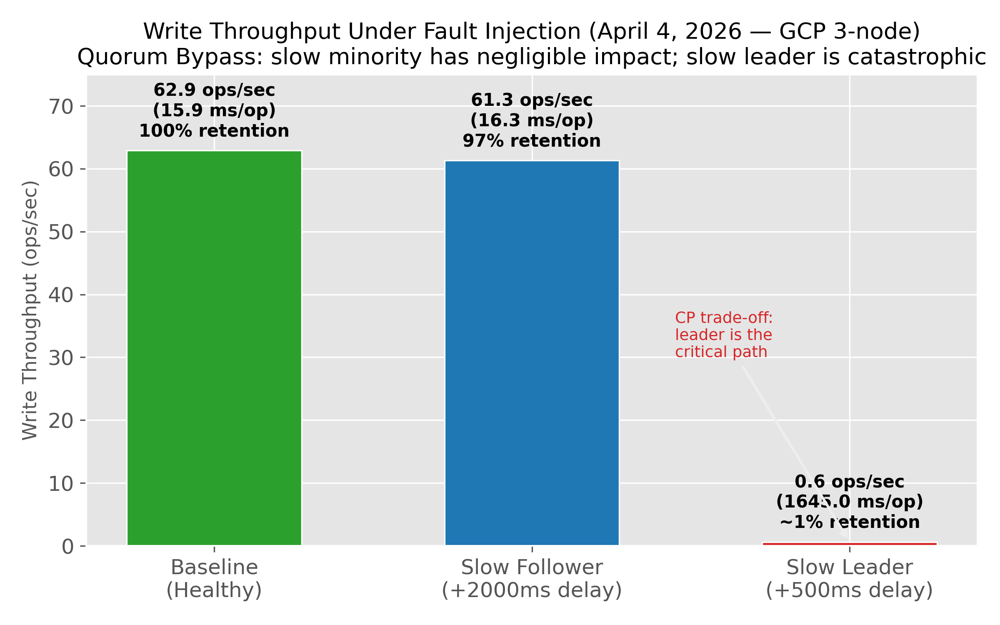
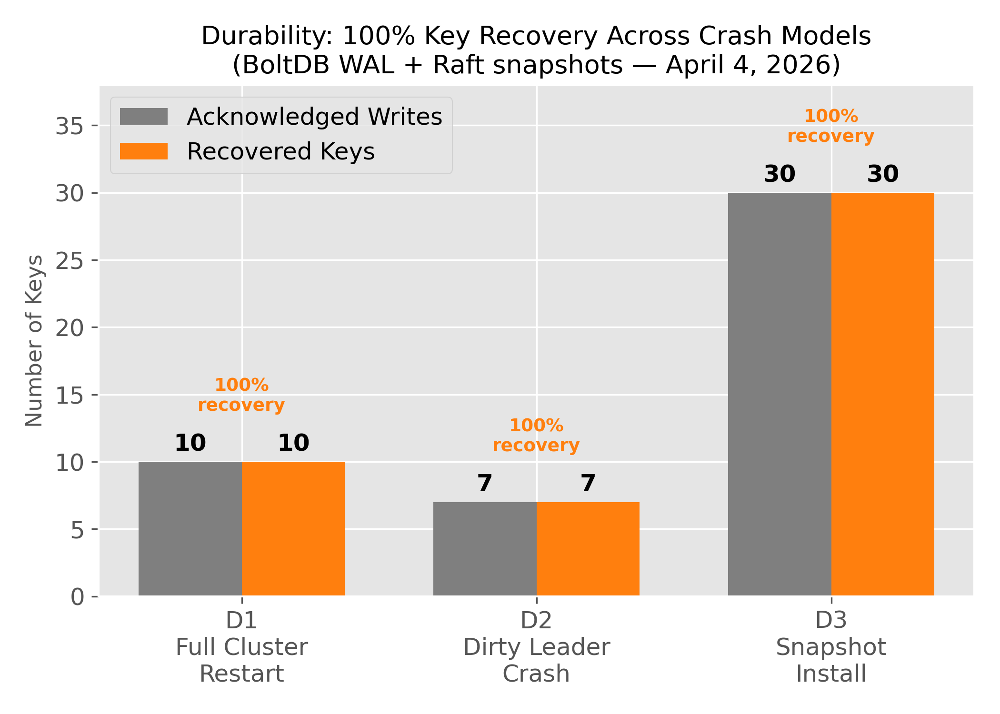
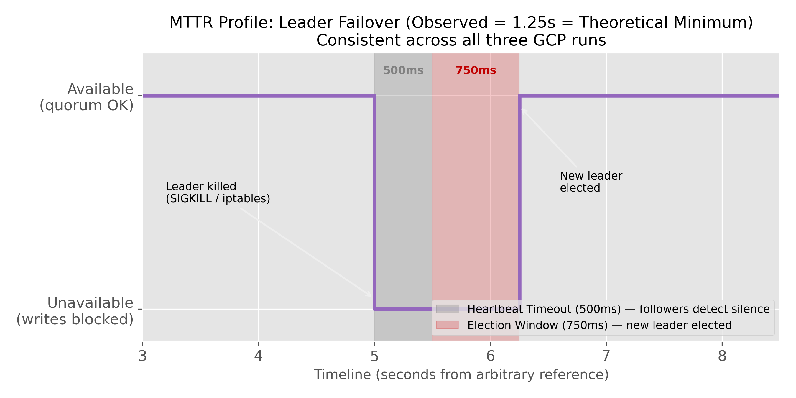

# Project 3 — Distributed Raft-Backed Key-Value Store

**Team:** Group 15 — Aarish, Ankith, Dhwani, Ankush
**Course:** CMPT 756 — Fault-Tolerant Distributed Systems
**Code & deployment:** https://github.com/Vermillion-1/Distributed-RAFT-KV-Storage
**Extended analysis:** `analysis/results_analysis.md` · `analysis/analysis_notebook.ipynb`

---

## System Design

We built a **CP key-value store** per the CAP theorem: under a network partition, the minority partition refuses writes rather than risk stale or divergent commits. The design is organized around three principles:

**Single-leader Raft consensus.** All writes are serialized through the current leader using HashiCorp Raft. A write is committed only when `⌊N/2⌋ + 1` nodes (a majority) have durably written the log entry. Minority followers are off the critical commit path — a slow or failed minority node does not block the majority.

**Linearizability on reads.** Default reads call `raft.VerifyLeader()`, which requires a round-trip majority heartbeat before the leader serves its local state. This closes the stale-leader window: a partitioned stale leader cannot pass VerifyLeader and therefore cannot return stale data. v1.3 adds a Read-Index follower-read path (FEAT-RI): a follower asks the leader for its current `commit_index`, waits until its own `appliedIndex ≥ commit_index`, then serves the read locally — linearizable without leader redirection.

**Exactly-once writes.** Each client carries a UUID `client_id` and a monotonically incrementing `seq_num`. The FSM maintains a per-client deduplication table; a write with a previously-seen `(client_id, seq_num)` is silently dropped, making client retries across leader changes safe.

**OS-level fault injection.** Each GCP VM runs two independent processes: the `kv-store` replica and a `node-agent` sidecar. The sidecar applies faults at the OS level — `SIGKILL`/`SIGSTOP`, bidirectional `iptables DROP`, and `tc netem` delay — without any cooperation from the replica. This ensures fault injection is as close to real network conditions as possible.

---

## Implementation

| Dimension | Choice |
|-----------|--------|
| Platform | GCP — 5× e2-micro VMs, `us-central1-a/c` (cross-zone ~15ms RTT) |
| Language | Go |
| Consensus | HashiCorp Raft v1.7.3 |
| Log storage | BoltDB (memory-mapped, synchronous writes; survives SIGKILL) |
| Client API | gRPC / protobuf |
| Binaries | `kv-store` (replica), `node-agent` (sidecar), `kv-client` (smart client) |
| Ports | Raft TCP :12000–12004; gRPC :50051–50055 |
| Snapshot | Threshold = 10 entries (aggressive, to exercise `InstallSnapshot` in tests) |

The smart client (`kv-client`) transparently redirects to the leader on a "not leader" response, and supports a `-addrs` list for multi-node failover. Both N=3 and N=5 cluster sizes were tested on GCP.

---

## Testing Methodology & Results

We designed a **seven-phase automated test suite** (43 tests total) executed via bash scripts that drive the sidecar HTTP API (`/api/kill`, `/api/pause`, `/api/chaos/partition`, `/api/chaos/netem`). Three GCP runs were conducted:

| Run | Date | Config | Result |
|-----|------|--------|--------|
| 1 | March 29, 2026 | 3-node v1.2 | 33/36 (3 bugs found) |
| 2 | April 1, 2026 | 5-node (post-fix) | 37/37 |
| 3 | April 4, 2026 | 3-node v1.3 | 37/37 + 6/6 Phase 7 |

**Final: 43/43 tests passing.**

| Phase | Focus | Tests | Result |
|-------|-------|-------|--------|
| P1 Liveness | Leader election, MTTR, quorum loss | 5 | 5/5 |
| P2 Partitions | Minority/majority partition, log catch-up | 9 | 9/9 |
| P3 Latency | Throughput under fault injection | 3 | 3/3 |
| P4 Durability | Crash recovery, snapshot install | 4 | 4/4 |
| P5 Idempotency | Exactly-once writes, dedup table | 8 | 8/8 |
| P6 Kernel Chaos | iptables + tc netem faults | 11 | 11/11 |
| P7 Follower Reads | Read-Index linearizability | 6 | 6/6 |

---

## Results & Analysis

### Write Throughput Under Fault Injection (Figure 1)

A 2000ms `tc netem` delay on one follower reduces throughput by only **2.5%** (62.9 → 61.3 ops/sec; 16.3 ms/op vs 15.9 ms/op baseline). The same delay on the leader NIC collapses throughput by **99%** (0.6 ops/sec; 1645 ms/op). This asymmetry is the direct consequence of Raft's quorum design: the minority follower is off the commit path, while every write traverses the leader twice (receive + ACK). The quorum bypass is not approximate — it is near-perfect (97% throughput retention).

### Durability Across Crash Models (Figure 2)

100% of acknowledged writes survived across three distinct crash scenarios: full cluster wipe and restart (D1), dirty leader kill mid-write (D2), and snapshot-based catch-up after 30 missed entries (D3). BoltDB's synchronous write-ahead log ensures no acknowledged log entry is lost on `SIGKILL`. The aggressive snapshot threshold (10 entries) forced `InstallSnapshot` RPCs in D3, exercising the full recovery code path.

### MTTR Profile (Figure 3)

MTTR of **~1.25 seconds** was observed on every run, exactly matching the theoretical minimum (`HeartbeatTimeout + ElectionTimeout = 500ms + 750ms`). This is deterministic, not probabilistic: followers fire their election timer at exactly `HeartbeatTimeout` after the last heartbeat, and in a quiescent cluster, the first candidate wins with two votes immediately.

### Argument of Correctness

**CP enforcement is active, not passive.** Three independent tests attempt writes to a partition that cannot reach quorum:

- **L3b** — 2 of 3 nodes killed; surviving node refuses writes.
- **P2c** — leader frozen (SIGSTOP); isolated leader with 1/3 nodes refuses writes.
- **N6c** — leader bidirectionally partitioned via iptables; isolated leader returns not-leader/timeout.

All three passed. The system does not silently degrade — it blocks availability rather than risk a stale commit. This is the defining characteristic of a CP system.

**Three bugs discovered and fixed** during development revealed non-obvious invariants: unidirectional iptables (BUG-4) created asymmetric partitions that let the isolated leader believe it still had connectivity; netem applied to the wrong NIC (BUG-5) failed to delay heartbeats, preventing the expected election; and a valid election outcome was initially mis-classified as a test failure (BUG-6). Each fix tightened the correctness guarantees.

**N=3 vs N=5 generalization.** Both cluster sizes pass all applicable tests. The `⌊N/2⌋ + 1` quorum threshold is correctly parameterized: unavailability triggers at exactly the right number of failures with no off-by-one errors.

---

*Word count: ~820 words (excluding tables and figure captions)*
